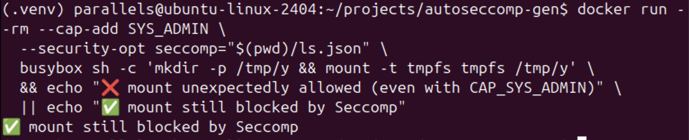

# AutoSeccomp‑Gen

Generate a ready‑to‑ship seccomp profile from **one single run** of your program or container.

<p align="center">
  
</p>

## Why

- **Smaller attack surface** – only the syscalls you actually need stay open.
- **Zero manual editing** – no more scrolling through huge strace logs.
- **Works everywhere** – plain Python 3, strace and Docker; ARM64 & x86‑64.

## Quick start

```bash
pip install -r requirements.txt
# list the network‑free syscalls of /bin/ls
autoseccomp trace-run "/bin/ls /" -o ls.json
# try to ping with that profile → blocked
docker run --rm --security-opt seccomp=ls.json busybox ping -c1 8.8.8.8

CLI
Sub‑command	Description
trace <log>	Show unique syscalls from an existing strace -f file.
generate <log> -o profile.json	Build a seccomp profile from that trace.
trace-run "<cmd>" -o profile.json	All‑in‑one: trace, generate, validate.

How it works
Runs your command under strace -f.

Merges the detected syscalls with a minimal Docker baseline (no networking).

Writes seccomp.json and re‑runs the command inside BusyBox to prove it works.


## Screenshots

> A few real runs that show how AutoSeccomp‑Gen works end-to-end.

### 0) Preflight
- **Environment sanity checks**
  
  

---

### 1) No-network suite overview
- **One-shot view of the “no network” profile behavior**
  
  

---

### 2) Networking profile (HTTP)
- **S02A – Trace + validate “http.json”**  
  

- **S02B – Internet HTTP first line**  
  

- **S02C – Local network first line (nginx in isolated docker network)**  
  

- **S02D – http.json contains network syscalls (socket/connect/sendto/recvfrom)**  
  

---

### 3) No-network profile blocks local network
- **S03 – “ls.json” blocks HTTP even on the isolated docker network**  
  

---

### 4) Fork/wait scenario
- **S04A – Trace & validate**  
  

- **S04B – Run shows “OK”**  
  

- **S04C – fork.json has clone/wait syscalls**  
  

---

### 5) Basic I/O scenario
- **S05A – Trace & validate**  
  

- **S05B – Run prints “hi”**  
  

- **S05C – io.json includes expected FS syscalls**  
  

---

### 6) Mount is blocked (even with CAP_SYS_ADMIN)
- **S06A – mount blocked with no extra caps**  
  

- **S06B – mount still blocked with CAP_SYS_ADMIN (Seccomp wins)**  
  

---

### 7) Safety & portability checks
- **S07A – “must-have” syscalls present**  
  

- **S07B – Architectures mapped (AARCH64 + X86_64)**  
  

---

### 8) Prepublish checker
- **S08 – One-command prepublish pass**  
  

